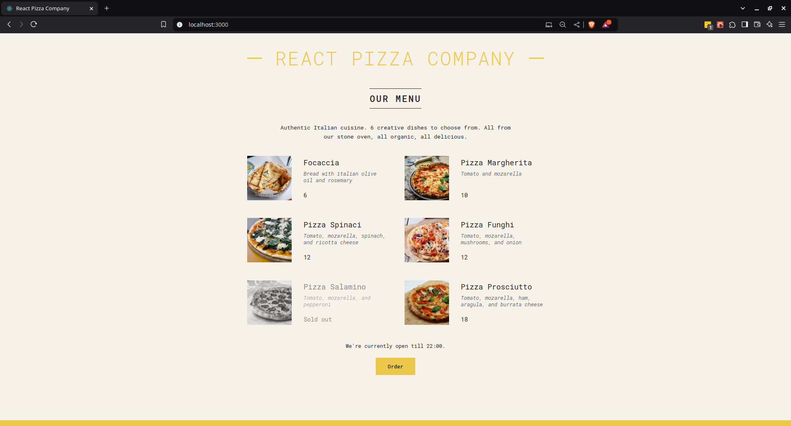

# ReactJS Pizza Application 🍕

## Motivation

This project is a React-based pizza menu application developed as part of learning modern React concepts like components, state management, and conditional rendering.

## Features ✨

1. **ReactJS** - v18.3
2. **CSS Modules**
3. **JavaScript (ES6)** - Basic language features

## Demo / Walkthrough



## How to Get and Run the Application 🛠️

### 1. Clone the application

```bash
git clone https://github.com/username/react-pizza-app.git
cd react-pizza-app
```

### 2. Install Dependencies

```bash
npm install
```

### 3. Run application in developemnt mode

```bash
npm start
```

### 4. Build for Production

```bash
npm run build
```

## Credits

- [**Facebook React Team**](https://github.com/facebook/react) for great documentation: [Learn React from Docs](https://react.dev/learn)
- 🧑‍🏫 [**Jonas Schmedtmann**](https://github.com/jonasschmedtmann)
- 🎓 [The Ultimate React Course 2024: React, Next.js, Redux & More](https://www.udemy.com/course/the-ultimate-react-course/)
